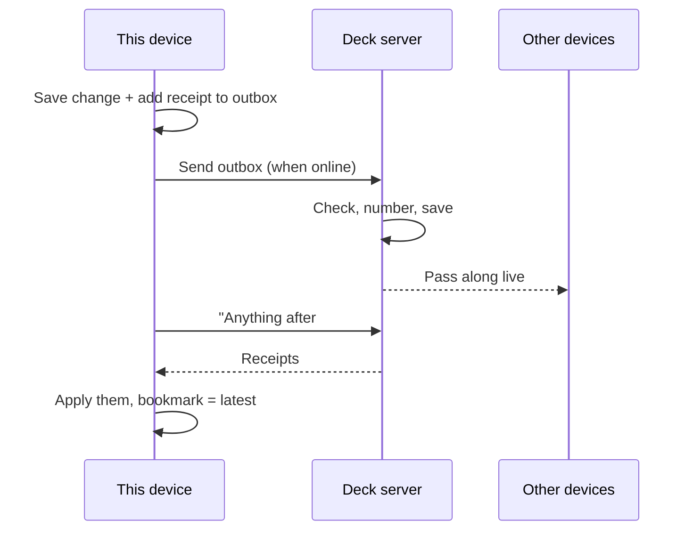

# Client User Flows

A plain-English walkthrough of everything a user can do in the app, and what happens behind the scenes each time.

This is written for project managers and anyone else who needs to reason about product behavior without reading code. It is based on `ARCHITECTURE.md`. The event catalog (`events.md`) and schema (`schema.sql`) that the brief mentions are not in the repo yet, so **the event names below are working labels**. Expect them to change when those files land.

---

## How to read this doc

Every flow has three parts:

1. **What the user does**, step by step.
2. **Events fired.** An *event* is a small receipt the app writes whenever something changes, such as "Fact 123: Capital changed to Paris". Receipts are how changes travel between the user's devices.
3. **Data changes.** What gets added, changed or removed in the user's deck.

### Five ideas that explain almost everything

- **Everything happens on the device first.** When a user taps "Save", the change is saved on their phone or laptop immediately. The internet is not required. This is called *offline-first*.
- **Every change leaves a receipt (an event).** Receipts go into an *outbox*, like an email outbox. When the device is online, the outbox is sent to the server.
- **The server numbers the receipts.** It stamps each one with the next number in line (#1, #2, #3…) and passes it to the user's other devices. Each device remembers "I've seen everything up to #812" and asks for anything newer.
- **Each deck is one file the user owns.** A deck is a single SQLite file, a standard database format. The user can back it up or open it with free tools, even if this app no longer exists.
- **Cards are generated, not written.** The user writes *facts*, like a country and its capital. The app builds the flashcards from those facts automatically, using *templates*.

### The things the app keeps track of

| Thing | Plain meaning | Example |
| --- | --- | --- |
| **Deck** | A study collection, stored as one file. | "World Geography" |
| **Fact type** | A kind of information the user wants to learn. Each deck defines its own. | "Country" |
| **Field** | One piece of information on a fact type. Can be text, formatted text, a number, an image or audio. | "Name", "Capital", "Flag" |
| **Template** | A recipe that turns a fact into one or more cards: what goes on the front and what goes on the back. | Front: "What is the capital of {{Name}}?" Back: "{{Capital}}" |
| **Fact** | One filled-in entry of a fact type. | Name = France, Capital = Paris |
| **Card** | A single flashcard, built from one fact plus one template. Never created by hand. | "What is the capital of France?" |
| **Review** | A record that the user studied a card and how well they did. Never edited or erased, only added to. | "Card 42, reviewed 9:14am, answered Good" |
| **Card progress** | When each card is next due and how well it is known. Always recalculated from the review history. | "Due again in 4 days" |
| **Media** | An image or audio file used in a fact. Stored inside the deck file. | france-flag.png |

### Two kinds of cards

A template is set to one of two modes:

- **One card per fact.** Each Country fact makes one "capital of…" card.
- **One card per cloze.** A *cloze* is a fill-in-the-blank, written like `{{c1::Paris}} is the capital of {{c2::France}}`. Each numbered blank becomes its own card, so that sentence makes two cards.

---

## The flows

1. [Signing in and opening a deck](#1-signing-in-and-opening-a-deck)
2. [Creating a deck](#2-creating-a-deck)
3. [Setting up a new device](#3-setting-up-a-new-device)
4. [Designing a fact type](#4-designing-a-fact-type)
5. [Creating or editing a template](#5-creating-or-editing-a-template)
6. [Adding a fact](#6-adding-a-fact)
7. [Editing a fact](#7-editing-a-fact)
8. [Deleting a fact](#8-deleting-a-fact)
9. [Adding an image or audio clip](#9-adding-an-image-or-audio-clip)
10. [Studying: reviewing a card](#10-studying-reviewing-a-card)
11. [Undoing a review](#11-undoing-a-review)
12. [Resetting a card's progress](#12-resetting-a-cards-progress)
13. [Seeing what's due today](#13-seeing-whats-due-today)
14. [Working offline and reconnecting](#14-working-offline-and-reconnecting)
15. [Two devices change the same thing](#15-two-devices-change-the-same-thing)
16. [Coming back after a long time away](#16-coming-back-after-a-long-time-away)
17. [Backing up or taking data elsewhere](#17-backing-up-or-taking-data-elsewhere)

---

### 1. Signing in and opening a deck

1. The user signs in or registers. This goes to the account service (a separate Rails app), not to the deck.
2. The account service checks which decks the user can access.
3. When the user opens a deck, the account service gives the device two things: the address of that deck's server, and a short-lived *pass* (a signed token). The pass says "this user may read/write this deck" and expires soon after.
4. The device connects to the deck's server with the pass and catches up on any changes (see flow 14).
5. When the pass expires, the device quietly asks the account service for a new one.

> **Events fired:** None. Signing in happens outside the deck, so no receipts are written.
>
> **Data changes:** None in the deck. The device stores the user's session and the pass.
>
> **PM note:** If the account service is down, users can still study and edit decks already on their device. They just can't sync until it's back.

---

### 2. Creating a deck

1. The user taps "New deck" and gives it a name.
2. The device creates the deck file immediately, with no internet needed. The deck gets a permanent ID generated on the device.
3. When online, the account service records the new deck and who owns it. The server creates its copy of the file the first time the deck syncs.

> **Events fired:** A *deck created* receipt with the deck's name.
>
> **Data changes:**
> - A new deck file appears on the device.
> - Inside it, a single deck record holds the name and settings.
> - An "about" section is written into the file explaining the format, so anyone who opens it years later can understand it.
>
> **PM note:** Creating the same deck twice (for example, after a network retry) is harmless. The server treats the second attempt as the same deck.

---

### 3. Setting up a new device

1. The user signs in on a new phone or laptop and picks a deck.
2. Instead of replaying every change ever made, the device downloads a *snapshot*: a copy of the deck as it is right now, plus the current receipt number.
3. From then on, the device keeps up by fetching only newer receipts.

> **Events fired:** None. The device is receiving, not changing anything.
>
> **Data changes:**
> - A full copy of the deck file appears on the new device.
> - The device records the receipt number the snapshot was taken at, its "last seen" bookmark.
>
> **PM note:** Snapshot size grows with the deck, especially with images and audio. How media is downloaded is still undecided.

---

### 4. Designing a fact type

This is where the user decides *what kind of thing* they're learning and what information each entry holds. It's like designing columns in a spreadsheet.

**4a. Creating a fact type**

1. The user taps "New fact type" and names it, e.g. "Country".
2. The app creates a real table for it inside the deck file, called something like `fact_country`. Anyone opening the file with a database tool sees a neat "Country" table.

> **Events fired:** *Fact type created* (ID, name, table name).
>
> **Data changes:** A new fact type record. A new, empty table for its facts.

**4b. Adding a field**

1. The user adds a field such as "Capital" and picks its kind: text, formatted text, number, image or audio.
2. A new column appears on the Country table.

> **Events fired:** *Field added* (field ID, name, kind, which fact type).
>
> **Data changes:** A new field record. A new column on the fact type's table. Existing facts show this field as empty.

**4c. Renaming a field or fact type**

1. The user renames "Capital" to "Capital city".
2. Nothing breaks. The app refers to fields by a permanent ID, never by name, so old receipts still point to the right place.

> **Events fired:** *Field renamed* or *Fact type renamed*.
>
> **Data changes:** The name changes, and the column in the file is renamed to match. Every fact keeps its data.

**4d. Changing a field's kind**

1. The user changes a field from, say, text to number.

> **Events fired:** *Field kind changed*.
>
> **Data changes:** Existing values are converted.
>
> **PM note:** The conversion rules are **undecided**. For example, what happens to "about 5" when text becomes a number? This needs product input.

**4e. Removing a field or fact type**

1. The user deletes a field, or the whole fact type.

> **Events fired:** *Field removed* or *Fact type removed*.
>
> **Data changes:** The field or type is marked deleted. Cards that depended on it disappear. The deletion always wins: if another device edits the field at the same time, the edit is ignored.

> **PM note (whole section):** Structural changes like these are applied in exactly the same order on every device, so all copies of the table always match. One open problem: two offline devices both create a "Country" type and both claim the table name `fact_country`. The current proposal is that the server rejects the second one and that device retries automatically as something like `fact_country_2`. What the user sees in that case hasn't been designed.

---

### 5. Creating or editing a template

1. The user opens a fact type and adds a template.
2. They write the front and back using placeholders, e.g. front "What is the capital of {{Name}}?", back "{{Capital}}".
3. They choose **one card per fact** or **one card per cloze**.
4. When they save, the app immediately builds a card for every existing fact of that type.

> **Events fired:** *Template created* or *Template updated* (front, back, mode).
>
> **Data changes:**
> - A template record is added or changed.
> - Cards are generated or removed to match. Adding a template to a type with 200 facts creates 200 new cards.
> - Card generation is automatic and identical on every device. It never produces its own receipts.
>
> **PM note:** Editing the front or back wording changes how cards look but keeps their study history.

---

### 6. Adding a fact

1. The user picks a fact type ("Country") and fills in the fields: Name = France, Capital = Paris, Flag = (image).
2. They tap "Save". The fact is saved on the device instantly, online or not.
3. Cards appear right away, one per template (or one per cloze blank).
4. The new cards are "new": due for their first study session.

> **Events fired:** *Fact created* (fact ID, fact type, the values for each field).
>
> **Data changes:**
> - A new row in the fact type's table (e.g. a new row in `fact_country`).
> - An entry in the deck's list of all facts.
> - New cards, built automatically. Each card's ID is calculated from the fact, the template and the cloze number, so every device builds the exact same cards without talking to each other.
> - The receipt sits in the outbox until it's sent.

---

### 7. Editing a fact

1. The user opens a fact and changes a value, e.g. fixes a typo in "Capital".
2. The change saves instantly. Cards built from that fact show the new text.
3. For cloze facts, adding a new blank (`{{c3::…}}`) adds a card. Removing a blank removes its card.

> **Events fired:** *Fact field updated*, one per changed field.
>
> **Data changes:**
> - The value in the fact's row changes.
> - The app records *when* that field was last changed. This is used to settle conflicts (flow 15).
> - Cards are added or removed if cloze blanks changed.
>
> **PM note:** If a user removes cloze #2 and later puts it back, that card **gets its old study history back**. Because the card is identified by fact + template + number, it's recognized as the same card.

---

### 8. Deleting a fact

1. The user deletes a fact.
2. It disappears, along with all of its cards.

> **Events fired:** *Fact deleted*.
>
> **Data changes:**
> - The row is removed from the fact type's table.
> - A *tombstone*, a "this was deleted" marker, is kept in the deck's fact list so other devices learn about it.
> - The fact's cards are removed.
> - Review history stays in the log, which only ever grows.
>
> **PM note:** **Delete always wins.** If a second device edits the fact while offline, that edit is discarded once the devices sync. There is currently no "restore deleted fact" flow.

---

### 9. Adding an image or audio clip

1. While adding or editing a fact, the user attaches a picture or recording.
2. The file is stored *inside* the deck file, so the deck stays a single, complete file.
3. The file is named by a fingerprint of its contents. Attaching the same picture twice stores it only once.

> **Events fired:** The fact's *Fact created* or *Fact field updated* receipt. The receipt carries only the fingerprint, not the file itself.
>
> **Data changes:**
> - The file's bytes are stored in the deck's media storage.
> - The fact's field holds the fingerprint that points to it.
>
> **PM note:** How the actual file travels to other devices is **undecided**. Until then, another device may know a fact has a picture before it has downloaded the picture. The UI needs a "loading" or "not yet available" state.

---

### 10. Studying: reviewing a card

This is the core loop users spend most of their time in.

1. The user starts a study session. The app shows cards that are due.
2. It shows the front. The user tries to recall the answer, then reveals the back.
3. The user rates how well they knew it (for example Again / Hard / Good / Easy).
4. The app works out when to show the card next and moves on.

> **Events fired:** *Card reviewed* (card ID, rating, time, which user).
>
> **Data changes:**
> - A new entry is added to the review log. Reviews are never edited or deleted.
> - The card's progress (next due date, how well it's known) is recalculated by replaying all of that card's reviews in time order.
>
> **PM note:** Reviews never conflict. If the user studies the same card on their phone and laptop while both are offline, **both reviews count** when they sync, and the schedule is recalculated from the full history. The scheduling method is not final. FSRS, a modern spaced-repetition algorithm, is the likely choice.

---

### 11. Undoing a review

1. Right after rating a card, the user taps "Undo".
2. The card comes back as if the review hadn't happened.

> **Events fired:** *Review voided* (which review).
>
> **Data changes:**
> - The original review stays in the log but is marked void.
> - Card progress is recalculated without it.
>
> **PM note:** Undo doesn't erase anything, so it syncs safely. An undo made on one device also undoes the review on every other device.

---

### 12. Resetting a card's progress

1. The user chooses "Reset progress" on a card, e.g. after changing its content a lot.
2. The card goes back to "new" and will be studied from scratch.

> **Events fired:** *Card reset*. This is stored as a special kind of review.
>
> **Data changes:**
> - A "reset" entry is added to the review log.
> - When progress is recalculated, everything before the reset is ignored.
>
> **PM note:** Older history is still kept in the file, so reporting on "all-time" study is still possible.

---

### 13. Seeing what's due today

1. The user opens the home screen.
2. The app shows how many cards are due across all their decks.

> **Events fired:** None. This only reads data.
>
> **Data changes:** None.
>
> **PM note:** The device counts across its own deck files, so this is fast and works offline. Features like "email me when cards are due" would need the server to keep its own summary. That's planned for later.

---

### 14. Working offline and reconnecting

This runs in the background. Users mostly don't notice it, which is the point.

1. While offline, the user keeps working normally. Every change saves instantly and its receipt joins the outbox.
2. When the device reconnects, it **sends** its outbox to the server, oldest first.
3. The server checks each receipt, stamps it with the next number, saves it and passes it to the user's other connected devices.
4. The device then **fetches** every receipt newer than its bookmark, applies them, and moves the bookmark forward.
5. While connected, new changes from other devices also arrive live, within a second or so.

> **Events fired:** No new ones. This flow moves existing receipts around.
>
> **Data changes:**
> - Sent receipts leave the outbox and get their server number.
> - Receipts from other devices are applied, updating facts, templates, cards and progress.
> - The "last seen" bookmark moves forward.
>
> **PM note:** Sending the same receipt twice is harmless. The server spots duplicates. A flaky connection can retry freely without creating double entries.

---

### 15. Two devices change the same thing

What users experience when they edit on two devices before they sync.

| Situation | What happens |
| --- | --- |
| Phone changes the Capital, laptop changes the Flag, on the same fact | Both changes are kept. Conflicts are settled per field, not per fact. |
| Phone and laptop both change the Capital | The **later** edit wins. Timing uses a special clock that stays accurate even when device clocks are a little off. |
| One device deletes a fact, another edits it | **The delete wins.** The edit is discarded. |
| Both devices review the same card | **Both reviews count.** |
| Both devices create a fact type with the same name | Open question. See the note in flow 4. |

> **Events fired:** None extra. Conflicts are settled automatically when receipts are applied.
>
> **Data changes:** For each field, the app keeps the time of its last change and only accepts a newer one. All devices end up with exactly the same data.
>
> **PM note:** Users are never asked to resolve a conflict by hand. The trade-off: a losing edit disappears without a notice. Whether to tell the user is a product decision.
>
> **PM note:** A device whose clock is set more than about 5 minutes in the future will have its changes rejected by the server. The UI should explain this.

---

### 16. Coming back after a long time away

1. The user opens the app on a device they haven't used in a long time.
2. The server only keeps a limited history of receipts. If the device's bookmark is older than that, catching up receipt by receipt isn't possible.
3. The device does a **full resync**: it downloads a fresh snapshot, as in flow 3.
4. Any unsent changes in the device's outbox are still sent first.

> **Events fired:** None new.
>
> **Data changes:** The device's copy of the deck is replaced with a fresh snapshot, and the bookmark resets to the snapshot's number.
>
> **PM note:** How long the server keeps history is **undecided**. It sets how long a device can be away before it needs a full resync.

---

### 17. Backing up or taking data elsewhere

1. The user copies their deck file somewhere, e.g. a USB drive or cloud storage.
2. That file is complete: facts, templates, study history and media.
3. It can be opened with any standard database tool and read without this app. It even contains a description of its own format.

> **Events fired:** None.
>
> **Data changes:** None.
>
> **PM note:** This is a core promise of the product: users own their data, and it should still be readable in 50 years. Features that store user data outside the deck file work against it.

---

## Open questions that affect the user experience

These are marked undecided in the architecture brief. Each has a visible product impact.

| Question | Why a PM should care |
| --- | --- |
| Rules for changing a field's kind (flow 4d) | Decides whether users can lose data when they change a field from text to number. |
| Name clashes for fact types and fields (flow 4) | Decides what users see when two devices create the same thing offline. |
| How images and audio sync (flow 9) | Decides whether pictures can show up late on a second device, and how large first-time setup is. |
| How long the server keeps history (flow 16) | Decides how long a device can sit unused before a full re-download. |
| Which scheduling algorithm (flow 10) | Decides how due dates are chosen, which is the core of the learning experience. |
| Shared or collaborative decks | Not designed yet. The data already records which user made each review, so it's possible later. |
| Telling users when their edit lost a conflict (flow 15) | Not addressed in the brief. Today it would disappear without a notice. |
